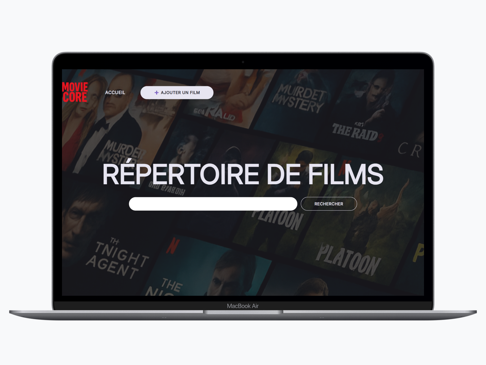

## [ENGLISH VERSION]

### 🎯 Learning Goals

This project was developed to:

- **Reinforce core skills** in PHP and database handling with PDO.

- **Understand CRUD operations** (Create, Read, Update, Delete) using SQL.

- **Build dynamic web pages** with PHP templating.

- **Structure a PHP project** with clarity and separation of concerns.

### ⚙️ Features

- **Add a movie:** Fill out a form to add a new movie to the database.

- **Edit a movie:** Modify the details (title, director, year, description) of an existing movie.

- **Delete a movie:** Remove a movie permanently from the database.

- **Movie detail page:** Click on a movie to view all its information on a dedicated page.

- **Simple design and user-friendly navigation.**

### 💡 Technologies used

- PHP

- MySQL with PDO

- HTML & CSS/SCSS

## [VERSION FRANÇAISE]

### 🎯 Objectifs d'apprentissage

Ce projet a été développé pour :

- **Renforcer mes compétences de base** en PHP et gestion de base de données avec PDO.

- **Comprendre les opérations CRUD** (Créer, Lire, Mettre à jour, Supprimer) avec SQL.

- **Construire des pages web dynamiques** avec du templating PHP.

- **Structurer un projet PHP** de façon claire et maintenable.

### ⚙️ Fonctionnalités

- **Ajouter un film :** Remplir un formulaire pour ajouter un nouveau film à la base de données.

- **Modifier un film :** Changer les informations d’un film existant (titre, réalisateur, année, description).

- **Supprimer un film :** Supprimer définitivement un film de la base de données.

- **Page dédiéeà un film :** Cliquer sur un film pour accéder à une page contenant tous ses détails.

- **Design simple et navigation intuitive.**

### 💡 Technologies utilisées

- PHP

- MySQL avec PDO

- HTML & CSS/SCSS

### Screenshot

